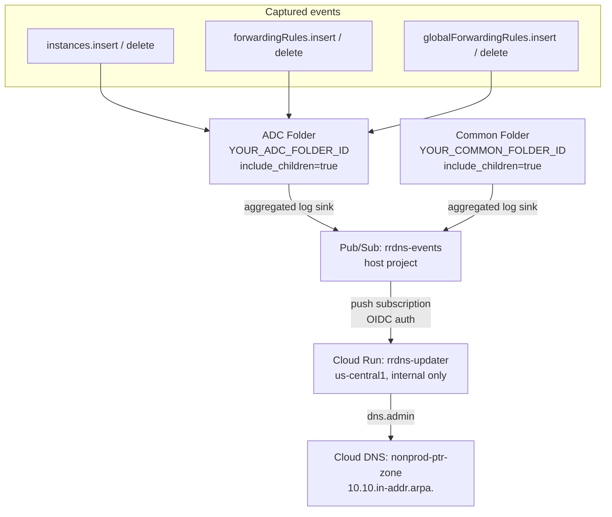
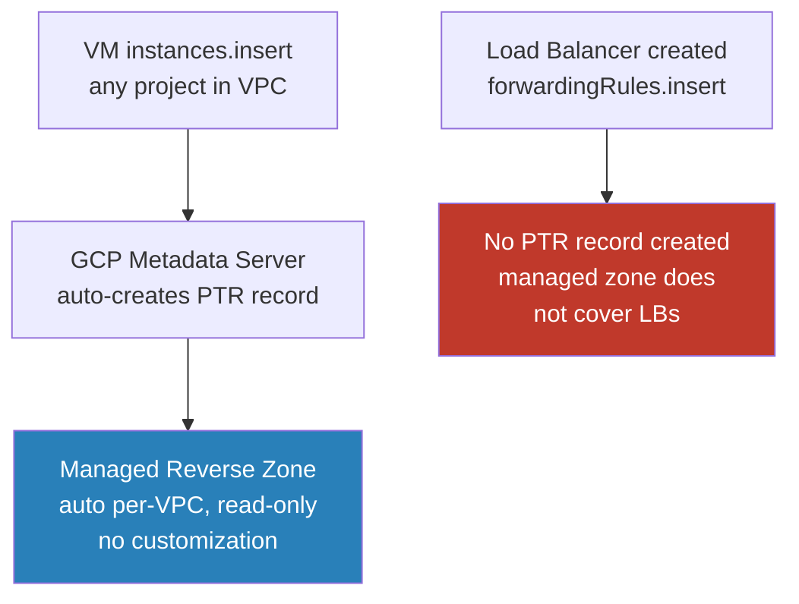
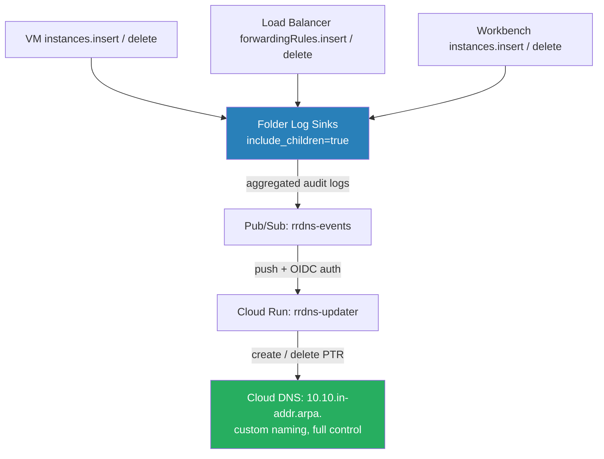
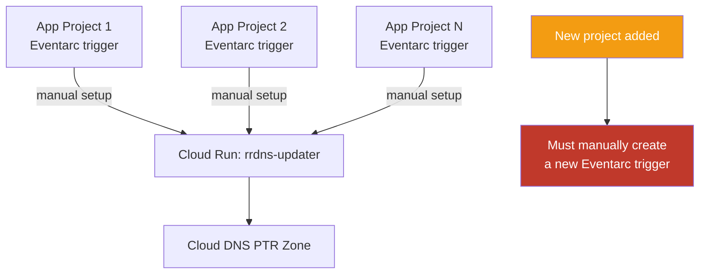
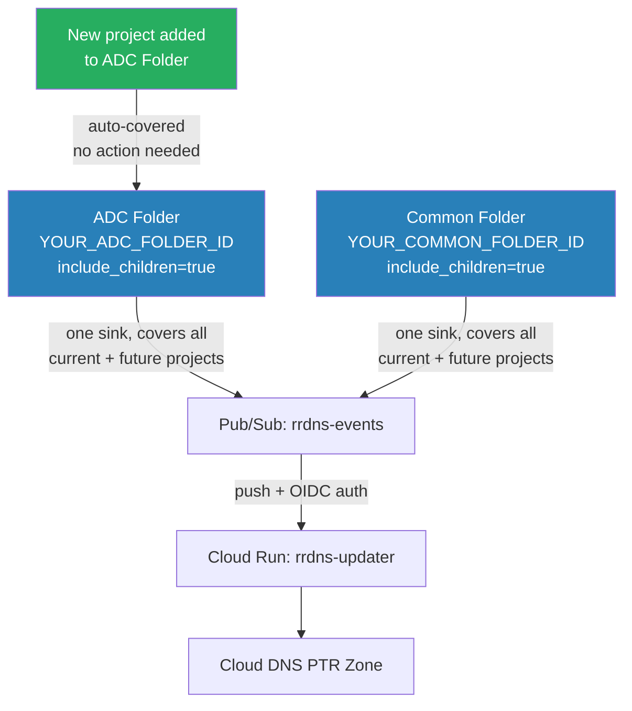

# GCP Reverse DNS Lab (gcp_rrdns_lab)

## Overview

Automated reverse DNS (PTR record) management for `vpc-nonprod-shared` in a Shared VPC architecture.
Folder-level log sinks capture Compute Engine audit events across all projects in the ADC and Common folders, publishing to a Pub/Sub topic. A Cloud Run service processes these events and creates/deletes PTR records in Cloud DNS.

New application projects added to the ADC folder are automatically covered — no config changes needed.

---

## Architecture

```
  instances.insert/delete          ┐
  forwardingRules.insert/delete    ├──► ADC Folder (aggregated log sink)    ──┐
  globalForwardingRules.*          ┘                                           │
                                                                               ▼
  instances.insert/delete          ┐                                  Pub/Sub: rrdns-events
  forwardingRules.insert/delete    ├──► Common Folder (aggregated log sink) ──┘        │
  globalForwardingRules.*          ┘                                          push sub  │
                                                                              OIDC auth ▼
                                                                      Cloud Run: rrdns-updater
                                                                          (internal only)
                                                                                   │
                                                                              dns.admin
                                                                                   ▼
                                                                      Cloud DNS: nonprod-ptr-zone
                                                                        (10.10.in-addr.arpa.)
```

> **GitHub users:** the diagram below renders interactively on github.com



---

## Design Decisions

### Managed Reverse Zone vs. Custom Zone

GCP provides a built-in managed reverse lookup zone per VPC, but it only covers VM instances. This lab replaces it with a self-managed private Cloud DNS zone driven by event automation.

| Feature | GCP Managed Reverse Zone | Custom Zone (this lab) |
|---|---|---|
| Setup | Automatic — no config required | Manual: create zone + event-driven automation |
| VM PTR records | Auto-created by GCP metadata server | Created by Cloud Run on `instances.insert` |
| Load Balancer PTR records | **Not supported** | Supported via `forwardingRules.insert` |
| Workbench PTR records | Auto (VMs under the hood) | Supported (same code path as VMs) |
| Custom PTR naming | None — fixed GCP format | Full control over naming convention |
| Cross-project coverage | Per-project, isolated | Folder-level: all projects in the folder |
| New project onboarding | Automatic | Zero-touch (`include_children=true` on folder sinks) |
| Record cleanup on delete | Automatic | Cloud Run on `instances/forwardingRules.delete` |
| Operational complexity | None | Cloud Run service + log sinks required |

#### GCP Managed Reverse Zone flow

```
  VM created (any project)
       │
       ▼
  GCP Metadata Server ──────────────► Managed Reverse Zone
  auto-creates PTR record             (auto per-VPC, read-only,
                                       no customization)

  Load Balancer created
       │
       ▼
  [No PTR record created — managed zone does not cover LBs]
```

> **GitHub users:** the diagram below renders interactively on github.com



#### Custom Zone flow (this lab)

```
  instances.insert / delete         ┐
  forwardingRules.insert / delete   ├──► Folder Log Sinks ──────────────► Pub/Sub: rrdns-events
  Workbench instances.*             ┘    (include_children=true)                    │
                                                                          push sub  │
                                                                          OIDC auth ▼
                                                                  Cloud Run: rrdns-updater
                                                                           │
                                                                    create / delete PTR
                                                                           ▼
                                                                  Cloud DNS: 10.10.in-addr.arpa.
                                                                  (custom naming, full control)
```

> **GitHub users:** the diagram below renders interactively on github.com



---

### Eventarc vs. Pub/Sub + Folder Log Sinks

Eventarc is GCP's native event routing service and a natural first choice for triggering Cloud Run from Compute Engine events. This lab uses folder-level Log Sinks + Pub/Sub instead for org-wide coverage without per-project configuration.

| Feature | Eventarc | Pub/Sub + Folder Log Sinks (this lab) |
|---|---|---|
| Trigger scope | Per-project — one trigger per project | Folder-level — one sink covers all projects in the folder |
| New project onboarding | Manual: create a new Eventarc trigger | Zero-touch: new projects auto-covered by `include_children=true` |
| Config at scale (N projects) | O(N) triggers to manage | O(1) — two folder sinks regardless of project count |
| Event buffering & retry | Eventarc handles internally | Pub/Sub: configurable ack deadline, exponential backoff |
| Message replay | Not supported | Pub/Sub supports replay from snapshot |
| Delivery to Cloud Run | Direct HTTP push | Push subscription → Cloud Run (OIDC) |
| Cloud Run ingress needed | Internal or external | Internal only (push subscription uses private path) |
| Audit log filter control | Per-trigger, per-event-type | Single log filter applied folder-wide |
| IAM setup | Eventarc SA per project | Single push subscription SA in host project |

#### Eventarc approach

```
  App Project 1 ──► Eventarc trigger ──┐
                    (manual setup)      │
  App Project 2 ──► Eventarc trigger ──┤
                    (manual setup)      ├──► Cloud Run: rrdns-updater ──► Cloud DNS PTR Zone
  App Project N ──► Eventarc trigger ──┘
                    (manual setup)

  New project added ──► [Must manually create a new Eventarc trigger]
```

> **GitHub users:** the diagram below renders interactively on github.com



#### Pub/Sub + Folder Log Sinks approach (this lab)

```
  ADC Folder (include_children=true) ──────────────────────────────────┐
    └── App Project 1 (auto-covered)                                    │
    └── App Project 2 (auto-covered)                            Pub/Sub: rrdns-events
    └── New project added → auto-covered, no action needed              │
                                                               push sub │
  Common Folder (include_children=true) ──────────────────────OIDC auth▼
    └── Host project (auto-covered)                    Cloud Run: rrdns-updater
                                                                        │
                                                                        ▼
                                                           Cloud DNS PTR Zone
```

> **GitHub users:** the diagram below renders interactively on github.com



---

## Infrastructure

| Resource | Name | Notes |
|---|---|---|
| Host Project | `your-host-project-id` | Shared VPC host |
| VPC | `vpc-nonprod-shared` | Global, custom subnet mode |
| DNS Zone | `nonprod-ptr-zone` | Private, `10.10.in-addr.arpa.`, regular (not managed) |
| Cloud Run | `rrdns-updater` | `us-central1`, internal ingress only |
| Artifact Registry | `rrdns-updater` | `us-central1`, Docker |

### Subnets (examples — replace with your own)

| Name | Region | CIDR |
|---|---|---|
| `your-subnet-uc1` | us-central1 | 10.10.0.0/24 |
| `your-subnet-ue4` | us-east4 | 10.10.1.0/24 |

### Log Sinks

| Sink | Folder | Covers |
|---|---|---|
| `rrdns-events-sink` | ADC (`YOUR_ADC_FOLDER_ID`) | All current + future app projects |
| `rrdns-events-sink` | Common (`YOUR_COMMON_FOLDER_ID`) | Host project and shared services |

**Log filter:**
```
protoPayload.serviceName="compute.googleapis.com"
AND protoPayload.methodName=~"v1.compute.(instances|forwardingRules|globalForwardingRules).(insert|delete)"
```

### Application Projects

| Project | Subnet | CIDR |
|---|---|---|
| `your-app-project-id` | `app-project-subnet` | 10.10.X.0/24 |

---

## PTR Naming Convention

### VMs (current)
Pattern extracted from audit log `resourceName`:
```
projects/<project>/zones/<zone>/instances/<name>
```
PTR value:
```
<name>.<zone>.c.<project>.internal.
```
Example: `test-rrdns.us-central1-a.c.your-host-project-id.internal.`

### Internal Load Balancers (current)
Pattern extracted from audit log `resourceName`:
```
projects/<project>/regions/<region>/forwardingRules/<name>
```
PTR value:
```
<name>.<region>.<project>.internal.
```
Example: `my-ilb.us-central1.my-service-project.internal.`

---

## TODO: PTR Record Reconciliation / Cleanup

**Status:** Designed, not implemented. Revisit when ready.

**Problem:** If a delete event is missed (Cloud Run down, retry exhaustion, bulk deletion), PTR records become stale indefinitely. No garbage collection exists today.

**Designed Solution:**

| Component | Detail |
|---|---|
| Custom IAM role | `dns.resourceRecordSets.list/delete`, `dns.changes.create/get`, `dns.managedZones.get` — no full `dns.admin` |
| Dedicated SA | `rrdns-reconcile-sa` — separate from event-handler SA, least privilege |
| `/reconcile` endpoint | New route on existing `rrdns-updater` Cloud Run service |
| Cloud Scheduler | Every 6 hours, OIDC auth using reconcile SA |
| Safety | Only delete on confirmed 404 — skip on 403/5xx. Dry-run mode via `?dry_run=true` |
| Audit trail | Structured JSON logs to Cloud Logging for every decision |

**Reconciliation logic:**
1. List all PTR records in `nonprod-ptr-zone`
2. Parse FQDN to determine resource type:
   - `name.zone.c.project.internal.` → VM (has `.c.`)
   - `name.region.project.internal.` → LB (no `.c.`)
3. Call Compute API — if 404 → delete PTR, if any other error → skip + log
4. Return structured summary of actions taken

**Flow:**
```
Cloud Scheduler (every 6h)
    → OIDC token (reconcile SA)
    → Cloud Run /reconcile
    → List PTR records
    → For each: Compute API check
    → 404? Delete. Else? Keep + log.
    → Cloud Logging (full audit trail)
```

---

## TODO: Alternative Naming Strategies

### Vertex AI Workbench Instances
Workbench creates Compute Engine VMs, caught automatically by `instances.insert`.
Audit log includes labels that could be used for friendlier naming:
```json
{
  "labels": {
    "goog-notebooks-instance-name": "my-workbench",
    "goog-notebooks-user-email": "user@domain.com"
  }
}
```
**Options to explore:**
- Use `goog-notebooks-instance-name` label as PTR value instead of raw VM name
- Create a separate PTR format for notebooks: `<notebook-name>.notebooks.<project>.internal.`

### General label-based naming
Consider reading instance labels from the Compute API response and using a custom label
(e.g., `dns-name`) to override the auto-generated PTR value. This would allow teams to
set their own friendly DNS names without changing VM names.

### GKE Nodes
GKE nodes are also Compute Engine VMs — currently caught by `instances.insert`.
May want to suppress PTR records for GKE nodes (identifiable via `goog-gke-node` label)
or use a different naming scheme.

---

## Adding an Application Project

1. Add the project to the ADC folder (`YOUR_ADC_FOLDER_ID`) — the folder-level log sinks automatically cover it.
2. Attach it as a Shared VPC service project and share the relevant subnet.
3. Grant `rrdns-cloudrun-sa` `compute.viewer` at the folder level (already granted — covers all current and future projects in the folder).

No Terraform changes needed.

---

## Demo

Test resources (VMs, Workbench, ILBs) are commented out in `main.tf` to save cost.
Run these to recreate the demo environment.

### 1. Spin up host project test VMs (optional — for nslookup testing from inside VPC)

Uncomment the resources in `main.tf` and `outputs.tf`, then:
```bash
terraform apply -auto-approve
```

SSH in via IAP:
```bash
gcloud compute ssh test-rrdns-client --project=your-host-project-id --zone=us-central1-a --tunnel-through-iap
```

Test reverse DNS from inside the VM:
```bash
python3 -c "import socket; print(socket.gethostbyaddr('10.10.X.Y'))"
```

### 2. Create a VM in the app project (shows cross-project automation)

```bash
gcloud compute instances create test-adc-123 \
  --project=your-app-project-id --zone=us-central1-a \
  --machine-type=e2-micro \
  --subnet=projects/your-host-project-id/regions/us-central1/subnetworks/app-project-subnet \
  --no-address
```

### 3. Create a Workbench instance (shows Workbench is treated as a VM)

```bash
gcloud workbench instances create test-workbench \
  --project=your-app-project-id --location=us-central1-a \
  --machine-type=e2-standard-2 \
  --network=projects/your-host-project-id/global/networks/vpc-nonprod-shared \
  --subnet=projects/your-host-project-id/regions/us-central1/subnetworks/app-project-subnet \
  --disable-public-ip
```

### 4. Create a regional ILB

```bash
gcloud compute backend-services create test-ilb-backend \
  --project=your-app-project-id --region=us-central1 \
  --load-balancing-scheme=INTERNAL --protocol=TCP

gcloud compute forwarding-rules create test-ilb \
  --project=your-app-project-id --region=us-central1 \
  --load-balancing-scheme=INTERNAL \
  --network=projects/your-host-project-id/global/networks/vpc-nonprod-shared \
  --subnet=projects/your-host-project-id/regions/us-central1/subnetworks/app-project-subnet \
  --backend-service=test-ilb-backend --ports=80
```

### 5. Create a cross-region ILB (global forwarding rule)

```bash
# Proxy-only subnet required for Envoy-based LB
gcloud compute networks subnets create proxy-only-us-central1 \
  --project=your-host-project-id \
  --network=vpc-nonprod-shared --region=us-central1 \
  --range=10.10.200.0/24 --purpose=REGIONAL_MANAGED_PROXY --role=ACTIVE

gcloud compute backend-services create test-xregion-ilb-backend \
  --project=your-app-project-id --global \
  --load-balancing-scheme=INTERNAL_MANAGED --protocol=HTTP

gcloud compute url-maps create test-xregion-ilb-urlmap \
  --project=your-app-project-id --global \
  --default-service=test-xregion-ilb-backend

gcloud compute target-http-proxies create test-xregion-ilb-proxy \
  --project=your-app-project-id --global \
  --url-map=test-xregion-ilb-urlmap

gcloud compute forwarding-rules create test-xregion-ilb \
  --project=your-app-project-id --global \
  --load-balancing-scheme=INTERNAL_MANAGED \
  --network=projects/your-host-project-id/global/networks/vpc-nonprod-shared \
  --subnet=projects/your-host-project-id/regions/us-central1/subnetworks/app-project-subnet \
  --target-http-proxy=test-xregion-ilb-proxy --ports=80
```

### 6. Show PTR zone

```bash
gcloud dns record-sets list \
  --project=your-host-project-id \
  --zone=nonprod-ptr-zone --filter="type=PTR" \
  --format="table(name, rrdatas)"
```

Expected output (all records, including NS/SOA):

```
NAME                     TYPE  TTL    DATA
10.10.in-addr.arpa.      NS    21600  ns-gcp-private.googledomains.com.
10.10.in-addr.arpa.      SOA   21600  ns-gcp-private.googledomains.com. cloud-dns-hostmaster.google.com. 1 21600 3600 259200 300
6.3.10.10.in-addr.arpa.  PTR   300    test-vm.us-central1-a.c.your-app-project-id.internal.
7.3.10.10.in-addr.arpa.  PTR   300    test-workbench.us-central1-a.c.your-app-project-id.internal.
8.3.10.10.in-addr.arpa.  PTR   300    test-ilb.us-central1.your-app-project-id.internal.
9.3.10.10.in-addr.arpa.  PTR   300    test-xregion-ilb.global.your-app-project-id.internal.
```

The 4 PTR records correspond to the 4 demo resources (VM, Workbench, regional ILB, cross-region ILB). These are intentionally left stranded after cleanup to demonstrate the delete bug.

### 7. Demo: Managed Reverse Zone vs. Custom Zone

This demonstrates two things:
1. GCP's managed reverse lookup zone auto-resolves PTR for VMs — no pipeline needed
2. It does **not** cover Load Balancers — that gap is what `nonprod-ptr-zone` + `rrdns-updater` fills
3. Workbench PTR records look identical to VM PTR records (Workbench is a Compute Engine VM under the hood)

**Step 1 — Create a VM in the host project on the managed zone subnet:**
```bash
gcloud compute instances create test-managed-vm \
  --project=your-host-project-id --zone=us-central1-a \
  --machine-type=e2-micro \
  --subnet=projects/your-host-project-id/regions/us-central1/subnetworks/demo-managed-rrdns-uc1 \
  --no-address --shielded-secure-boot
```

**Step 2 — Create a Workbench instance in the app project on the same subnet:**
```bash
gcloud workbench instances create test-managed-wb \
  --project=your-app-project-id --location=us-central1-a \
  --machine-type=e2-standard-2 \
  --network=projects/your-host-project-id/global/networks/vpc-nonprod-shared \
  --subnet=projects/your-host-project-id/regions/us-central1/subnetworks/demo-managed-rrdns-uc1 \
  --disable-public-ip
```

> **Note:** The Workbench service agent needs `compute.networkUser` on the subnet:
> ```bash
> gcloud compute networks subnets add-iam-policy-binding demo-managed-rrdns-uc1 \
>   --project=your-host-project-id --region=us-central1 \
>   --member=serviceAccount:service-WORKBENCH_SA_NUMBER@gcp-sa-notebooks.iam.gserviceaccount.com \
>   --role=roles/compute.networkUser
> ```

**Step 3 — Get the IPs:**
```bash
gcloud compute instances describe test-managed-vm \
  --project=your-host-project-id --zone=us-central1-a \
  --format="value(networkInterfaces[0].networkIP)"
# e.g. 10.20.0.2

gcloud compute instances describe test-managed-wb \
  --project=your-app-project-id --zone=us-central1-a \
  --format="value(networkInterfaces[0].networkIP)"
# e.g. 10.20.0.3
```

**Step 4 — Reverse lookup both from inside the VPC:**
```bash
gcloud compute ssh test-managed-vm \
  --project=your-host-project-id --zone=us-central1-a --tunnel-through-iap \
  --command="python3 -c \"import socket; print('VM PTR:', socket.gethostbyaddr('10.20.0.2')); print('Workbench PTR:', socket.gethostbyaddr('10.20.0.3'))\""
```

**Observed output (actual test results):**
```
VM PTR:        ('test-managed-vm.us-central1-a.c.your-host-project-id.internal', ['test-managed-vm'], ['10.20.0.2'])
Workbench PTR: ('test-managed-wb.us-central1-a.c.your-app-project-id.internal', [], ['10.20.0.3'])
```

**Findings:**

| | VM | Workbench |
|---|---|---|
| PTR format | `<name>.<zone>.c.<project>.internal.` | `<name>.<zone>.c.<project>.internal.` |
| Project in FQDN | Host project (where VM was created) | App project (where Workbench was created) |
| Aliases list | `['test-managed-vm']` | `[]` (empty) |
| How PTR is created | Managed zone auto-serves via metadata server | Same — Workbench is a plain Compute Engine VM |
| No pipeline needed | ✓ | ✓ |

Key observations:
- PTR format is **identical** for VMs and Workbench — Workbench just provisions a Compute Engine VM with the same name
- The project in the FQDN reflects **where the resource was created**, not which VPC it's on
- No Cloud Run, no audit log, no Pub/Sub — the managed zone serves records automatically
- Aliases list is empty for Workbench vs populated for a plain VM (minor, not functionally significant)

**Step 5 — Show the gap: create an ILB and confirm no PTR:**
```bash
gcloud compute backend-services create demo-managed-ilb-backend \
  --project=your-host-project-id --region=us-central1 \
  --load-balancing-scheme=INTERNAL --protocol=TCP

gcloud compute forwarding-rules create demo-managed-ilb \
  --project=your-host-project-id --region=us-central1 \
  --load-balancing-scheme=INTERNAL \
  --network=vpc-nonprod-shared \
  --subnet=demo-managed-rrdns-uc1 \
  --backend-service=demo-managed-ilb-backend --ports=80

# Get ILB IP, then from inside the VM:
python3 -c "import socket; print(socket.gethostbyaddr('10.20.x.y'))"
# Returns: socket.herror — no PTR record, managed zone does not cover LBs
```

This is the gap that `nonprod-ptr-zone` + `rrdns-updater` solves for the `10.10.0.0/16` space.

**Cleanup:**
```bash
gcloud compute forwarding-rules delete demo-managed-ilb --project=your-host-project-id --region=us-central1 --quiet
gcloud compute backend-services delete demo-managed-ilb-backend --project=your-host-project-id --region=us-central1 --quiet
gcloud compute instances delete test-managed-vm --project=your-host-project-id --zone=us-central1-a --quiet
gcloud workbench instances delete test-managed-wb --project=your-app-project-id --location=us-central1-a --quiet
```

---

### Cleanup (post-demo)

```bash
# VMs
gcloud compute instances delete test-adc-123 --project=your-app-project-id --zone=us-central1-a --quiet
gcloud workbench instances delete test-workbench --project=your-app-project-id --location=us-central1-a --quiet

# Regional ILB
gcloud compute forwarding-rules delete test-ilb --project=your-app-project-id --region=us-central1 --quiet
gcloud compute backend-services delete test-ilb-backend --project=your-app-project-id --region=us-central1 --quiet

# Cross-region ILB
gcloud compute forwarding-rules delete test-xregion-ilb --project=your-app-project-id --global --quiet
gcloud compute target-http-proxies delete test-xregion-ilb-proxy --project=your-app-project-id --global --quiet
gcloud compute url-maps delete test-xregion-ilb-urlmap --project=your-app-project-id --global --quiet
gcloud compute backend-services delete test-xregion-ilb-backend --project=your-app-project-id --global --quiet
gcloud compute networks subnets delete proxy-only-us-central1 --project=your-host-project-id --region=us-central1 --quiet

# Host project test VMs (if spun up via Terraform)
# Comment out resources in main.tf and outputs.tf, then:
terraform apply -auto-approve
```

---

## File Structure

```
gcp_rrdns_lab/
├── app/
│   ├── main.py          # Cloud Run Flask app — handles Pub/Sub push events
│   ├── requirements.txt
│   └── Dockerfile
├── main.tf              # VPC data sources, DNS zone, test VMs (commented out)
├── providers.tf         # google provider
├── variables.tf         # project_id, vpc_name
├── apis.tf              # Enables required GCP APIs in host project
├── iam.tf               # Service accounts and IAM bindings
├── artifact_registry.tf # AR repo + Cloud Build (null_resource)
├── cloudrun.tf          # Cloud Run rrdns-updater service
├── pubsub.tf            # Pub/Sub topic, push subscription, log sink IAM
├── outputs.tf
└── README.md
```

### Redeploying Cloud Run after app/main.py changes

Terraform does not detect `:latest` tag changes. After editing `app/main.py`, run `terraform apply` to rebuild/push the image, then manually redeploy:

```bash
gcloud run deploy rrdns-updater \
  --project=your-host-project-id --region=us-central1 \
  --image=us-central1-docker.pkg.dev/your-host-project-id/rrdns-updater/rrdns-updater:latest
```

---

## Cost Analysis at Enterprise Scale

This section compares the four viable approaches to PTR automation at the scale of a typical enterprise GCP organization: hundreds of application projects spread across multiple environments and shared VPCs.

### Assumptions

| Parameter | Value |
|---|---|
| Application projects | 200–300 (use your actual count) |
| Environments | 3 (e.g. sandbox / nonprod / prod) |
| Shared VPCs | Multiple per environment, one per line-of-business |
| DNS query load | ~2M PTR lookups/month per VPC |
| Event volume (baseline) | ~5 events/day per project (VM/LB creates + deletes) |
| Event volume (high) | ~20 events/day per project (active CI/CD) |
| Event volume (extreme) | ~100 events/day per project (heavy ephemeral automation) |

Adjust these numbers to your organization. The conclusions are robust across a wide range of values because the pipeline cost stays inside GCP free tiers until very high churn.

### Solutions Compared

| ID | Solution |
|---|---|
| **A** | GCP Managed Reverse Zone (`reverse_lookup=true`) — auto PTR for VMs, no pipeline required |
| **B** | Folder Log Sinks + Pub/Sub + Cloud Run *(this repo)* |
| **C** | Eventarc per-project + Cloud Run |
| **D** | Hybrid — Managed Zone for VMs, custom zone + filtered sink for LBs only |
| **E** | Self-hosted DNS (BIND/CoreDNS on GCE HA pair per VPC) |

### GCP Service Pricing Reference

| Service | Free Tier | Paid Rate |
|---|---|---|
| Cloud Logging (Admin Activity audit logs) | **Free always** | — |
| Log sink routing | **Free** | — |
| Pub/Sub | First 10 GiB/month | $0.04/GiB |
| Cloud Run — requests | First 2M/month | $0.40/million |
| Cloud Run — CPU | First 180K vCPU-sec/month | $0.000024/vCPU-sec |
| Cloud Run — memory | First 360K GiB-sec/month | $0.0000025/GiB-sec |
| Eventarc | First 100K events/month | $0.40/million |
| Cloud DNS — zones | — | $0.20/zone/month (first 25) |
| Cloud DNS — queries (private) | — | $0.40/million |
| Cloud Scheduler | First 3 jobs/project | $0.10/job/month |
| GCE e2-small (24/7) | — | ~$12.50/month |

### Monthly Infrastructure Cost Per VPC

Example baseline: 50 projects × 5 events/day = 7,500 events/month per VPC.

| Cost Component | Sol A | Sol B | Sol C | Sol D (Hybrid) | Sol E (GCE) |
|---|---|---|---|---|---|
| Log Sinks | — | $0 | — | $0 | — |
| Pub/Sub | — | $0 | — | $0 | — |
| Cloud Run | — | $0 | $0 | $0 | — |
| Eventarc (N triggers) | — | — | $0 | — | — |
| Cloud DNS zone | $0.20 | $0.20 | $0.20 | $0.40 (2 zones) | $0.20 |
| DNS queries (2M) | $0.80 | $0.80 | $0.80 | $0.80 | $0.80 |
| GCE VM pair (HA) | — | — | — | — | ~$50.00 |
| **Total/VPC/month** | **$1.00** | **$1.00** | **$1.00** | **$1.20** | **~$51.00** |
| LB PTR coverage | **No** | Yes | Yes | Yes | Yes |

Solutions A, B, C, D all sit inside GCP free tiers at baseline volume. The dominant cost is DNS query charges — not the pipeline.

### Total Monthly Infrastructure Cost (Example: 15 VPCs)

Scaled to 5 lines-of-business × 3 environments = 15 shared VPCs.

| Solution | Baseline | High churn | Extreme churn\* | Annual |
|---|---|---|---|---|
| **A — Managed Zone** | $15 | $15 | $15 | **$180** *(LBs uncovered)* |
| **B — Folder Sinks** | $15 | $15 | ~$32 | **$180–384** |
| **C — Eventarc** | $15 | $15.30 | ~$34 | **$183–408** |
| **D — Hybrid** | $18 | $18 | ~$35 | **$216–420** |
| **E — GCE DNS** | $765 | $765 | $765 | **$9,180** |

> \*Extreme churn: Cloud Run CPU starts billing above free tier. At 100 events/day/project with 5 VPCs sharing 1 Cloud Run per environment → ~750K invocations/env/month → ~195K excess vCPU-seconds → ~$4.68/env. Three environments adds ~$14/month.

### Engineering Hours Comparison

#### Initial Setup

| Solution | Tasks | Estimated Hours |
|---|---|---|
| **A — Managed Zone** | Enable per VPC, verify PTR resolution | 4 hrs |
| **B — Folder Sinks** | Folder sinks, Pub/Sub, Cloud Run, DNS zones, IAM, Terraform | 24 hrs |
| **C — Eventarc** | Same as B + N Eventarc triggers per env × 3 envs, per-project IAM | 40+ hrs |
| **D — Hybrid** | Managed zones + filtered sink + Cloud Run for LBs, 2 zones per VPC | 30 hrs |
| **E — Self-hosted DNS** | HA VM pair setup, DNS config, update scripts, monitoring | 80+ hrs |

#### Ongoing Annual Maintenance

| Solution | Tasks | Hours/Year |
|---|---|---|
| **A — Managed Zone** | None — fully managed by GCP | 0 hrs |
| **B — Folder Sinks** | App updates, occasional Cloud Run redeploy, incident investigation | 8 hrs |
| **C — Eventarc** | App updates + trigger drift, debugging per-project missing events | 20 hrs |
| **D — Hybrid** | Same as B + two-zone interaction, suppressing VM events from LB sink | 15 hrs |
| **E — Self-hosted DNS** | VM patching, DNS config, HA failover testing, on-call coverage | 60+ hrs |

#### New Project Onboarding (per project, across all environments)

| Solution | Action Required | Hours per Project |
|---|---|---|
| **A — Managed Zone** | Nothing — automatic | 0 hrs |
| **B — Folder Sinks** | Nothing — `include_children=true` auto-covers | 0 hrs |
| **C — Eventarc** | Create one trigger per environment + IAM per project | ~1.5 hrs |
| **D — Hybrid** | Nothing — same as B | 0 hrs |
| **E — Self-hosted DNS** | Nothing — DNS servers already running | 0 hrs |

At 25 new projects/year, Solution C adds **~38 hours/year** of recurring onboarding work on top of the initial trigger setup.

### Reconciliation Add-On (Solution B)

The designed `/reconcile` endpoint (see TODO section above) adds negligible cost:

| Component | Cost |
|---|---|
| Cloud Scheduler (1 job per env, mostly within free tier) | ~$0.90/month |
| Cloud Run extra invocations (within free tier) | $0 |
| Compute API read calls | $0 (read APIs are free) |
| **Infrastructure total** | **~$0.90/month (~$11/year)** |
| Implementation effort (one-time) | ~16 hrs |

### Summary: Annual Cost of Ownership

Example: 15 VPCs, 25 new projects/year.

| Solution | Infra/Year | Setup (hrs) | Ongoing (hrs/yr) | Onboarding (hrs/yr) | **Total Hrs Yr 1** |
|---|---|---|---|---|---|
| **A — Managed Zone** | $180 | 4 | 0 | 0 | **4 hrs** *(LBs uncovered)* |
| **B — Folder Sinks** | $180–384 | 24 | 8 | 0 | **32 hrs** |
| **B + Reconcile** | $192–396 | 40 | 8 | 0 | **48 hrs** |
| **C — Eventarc** | $183–408 | 40 | 20 | 38 | **98 hrs** |
| **D — Hybrid** | $216–420 | 30 | 15 | 0 | **45 hrs** |
| **E — Self-hosted DNS** | $9,180 | 80+ | 60+ | 0 | **140+ hrs** |

### Key Takeaways

**Infrastructure cost is essentially a non-issue across all cloud-native solutions (A/B/C/D).** At enterprise scale you're spending $15–$35/month regardless of which event-driven approach you choose. DNS query charges dominate over pipeline costs, which stay inside GCP free tiers up to very high churn.

**Engineering hours are the real differentiator:**

- **Solution B** is O(1) infrastructure — folder-level sinks cover all projects in a folder permanently, including any future projects. 32 hours to build, 8 hours/year to maintain, 0 hours per new project. Pub/Sub retry and replay semantics also reduce incident surface compared to N independent Eventarc event streams.
- **Solution C (Eventarc)** has nearly identical infrastructure cost but 3× more engineering hours in year one, and compounds annually with onboarding overhead. At scale you own N triggers × 3 environments Terraform resources, each representing a manual per-project step.
- **Solution A (Managed Zone)** is the lowest-effort option but is a non-starter if any shared VPC has internal load balancers that need reverse DNS — which every production enterprise VPC does.
- **Solution E (self-hosted)** is an order of magnitude more expensive in infrastructure and should only exist if you have requirements Cloud DNS cannot satisfy (e.g. DNSSEC for private zones, non-GCP resolver integration).

Adding the reconciliation scheduler to Solution B is ~16 hours of one-time implementation for $11/year — the right follow-on once the event pipeline is in steady state.
