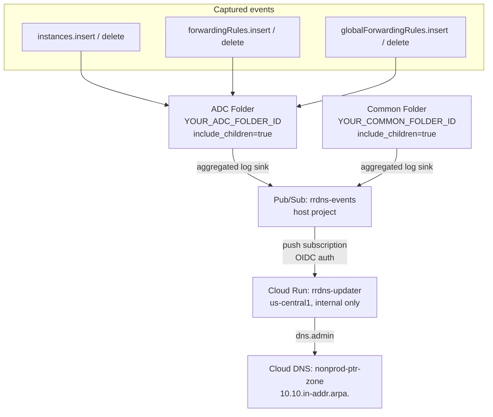

# GCP Reverse DNS Lab (gcp_rrdns_lab)

## Overview

Automated reverse DNS (PTR record) management for `vpc-nonprod-shared` in a Shared VPC architecture.
Folder-level log sinks capture Compute Engine audit events across all projects in the ADC and Common folders, publishing to a Pub/Sub topic. A Cloud Run service processes these events and creates/deletes PTR records in Cloud DNS.

New application projects added to the ADC folder are automatically covered — no config changes needed.

---

## Architecture

```
  instances.insert/delete          ┐
  forwardingRules.insert/delete    ├──► ADC Folder (aggregated log sink)    ──┐
  globalForwardingRules.*          ┘                                           │
                                                                               ▼
  instances.insert/delete          ┐                                  Pub/Sub: rrdns-events
  forwardingRules.insert/delete    ├──► Common Folder (aggregated log sink) ──┘        │
  globalForwardingRules.*          ┘                                          push sub  │
                                                                              OIDC auth ▼
                                                                      Cloud Run: rrdns-updater
                                                                          (internal only)
                                                                                   │
                                                                              dns.admin
                                                                                   ▼
                                                                      Cloud DNS: nonprod-ptr-zone
                                                                        (10.10.in-addr.arpa.)
```

> **GitHub users:** the diagram below renders interactively on github.com



---

## Infrastructure

| Resource | Name | Notes |
|---|---|---|
| Host Project | `your-host-project-id` | Shared VPC host |
| VPC | `vpc-nonprod-shared` | Global, custom subnet mode |
| DNS Zone | `nonprod-ptr-zone` | Private, `10.10.in-addr.arpa.`, regular (not managed) |
| Cloud Run | `rrdns-updater` | `us-central1`, internal ingress only |
| Artifact Registry | `rrdns-updater` | `us-central1`, Docker |

### Subnets (examples — replace with your own)

| Name | Region | CIDR |
|---|---|---|
| `your-subnet-uc1` | us-central1 | 10.10.0.0/24 |
| `your-subnet-ue4` | us-east4 | 10.10.1.0/24 |

### Log Sinks

| Sink | Folder | Covers |
|---|---|---|
| `rrdns-events-sink` | ADC (`YOUR_ADC_FOLDER_ID`) | All current + future app projects |
| `rrdns-events-sink` | Common (`YOUR_COMMON_FOLDER_ID`) | Host project and shared services |

**Log filter:**
```
protoPayload.serviceName="compute.googleapis.com"
AND protoPayload.methodName=~"v1.compute.(instances|forwardingRules|globalForwardingRules).(insert|delete)"
```

### Application Projects

| Project | Subnet | CIDR |
|---|---|---|
| `your-app-project-id` | `app-project-subnet` | 10.10.X.0/24 |

---

## PTR Naming Convention

### VMs (current)
Pattern extracted from audit log `resourceName`:
```
projects/<project>/zones/<zone>/instances/<name>
```
PTR value:
```
<name>.<zone>.c.<project>.internal.
```
Example: `test-rrdns.us-central1-a.c.your-host-project-id.internal.`

### Internal Load Balancers (current)
Pattern extracted from audit log `resourceName`:
```
projects/<project>/regions/<region>/forwardingRules/<name>
```
PTR value:
```
<name>.<region>.<project>.internal.
```
Example: `my-ilb.us-central1.my-service-project.internal.`

---

## TODO: PTR Record Reconciliation / Cleanup

**Status:** Designed, not implemented. Revisit when ready.

**Problem:** If a delete event is missed (Cloud Run down, retry exhaustion, bulk deletion), PTR records become stale indefinitely. No garbage collection exists today.

**Designed Solution:**

| Component | Detail |
|---|---|
| Custom IAM role | `dns.resourceRecordSets.list/delete`, `dns.changes.create/get`, `dns.managedZones.get` — no full `dns.admin` |
| Dedicated SA | `rrdns-reconcile-sa` — separate from event-handler SA, least privilege |
| `/reconcile` endpoint | New route on existing `rrdns-updater` Cloud Run service |
| Cloud Scheduler | Every 6 hours, OIDC auth using reconcile SA |
| Safety | Only delete on confirmed 404 — skip on 403/5xx. Dry-run mode via `?dry_run=true` |
| Audit trail | Structured JSON logs to Cloud Logging for every decision |

**Reconciliation logic:**
1. List all PTR records in `nonprod-ptr-zone`
2. Parse FQDN to determine resource type:
   - `name.zone.c.project.internal.` → VM (has `.c.`)
   - `name.region.project.internal.` → LB (no `.c.`)
3. Call Compute API — if 404 → delete PTR, if any other error → skip + log
4. Return structured summary of actions taken

**Flow:**
```
Cloud Scheduler (every 6h)
    → OIDC token (reconcile SA)
    → Cloud Run /reconcile
    → List PTR records
    → For each: Compute API check
    → 404? Delete. Else? Keep + log.
    → Cloud Logging (full audit trail)
```

---

## TODO: Alternative Naming Strategies

### Vertex AI Workbench Instances
Workbench creates Compute Engine VMs, caught automatically by `instances.insert`.
Audit log includes labels that could be used for friendlier naming:
```json
{
  "labels": {
    "goog-notebooks-instance-name": "my-workbench",
    "goog-notebooks-user-email": "user@domain.com"
  }
}
```
**Options to explore:**
- Use `goog-notebooks-instance-name` label as PTR value instead of raw VM name
- Create a separate PTR format for notebooks: `<notebook-name>.notebooks.<project>.internal.`

### General label-based naming
Consider reading instance labels from the Compute API response and using a custom label
(e.g., `dns-name`) to override the auto-generated PTR value. This would allow teams to
set their own friendly DNS names without changing VM names.

### GKE Nodes
GKE nodes are also Compute Engine VMs — currently caught by `instances.insert`.
May want to suppress PTR records for GKE nodes (identifiable via `goog-gke-node` label)
or use a different naming scheme.

---

## Adding an Application Project

1. Add the project to the ADC folder (`YOUR_ADC_FOLDER_ID`) — the folder-level log sinks automatically cover it.
2. Attach it as a Shared VPC service project and share the relevant subnet.
3. Grant `rrdns-cloudrun-sa` `compute.viewer` at the folder level (already granted — covers all current and future projects in the folder).

No Terraform changes needed.

---

## Demo

Test resources (VMs, Workbench, ILBs) are commented out in `main.tf` to save cost.
Run these to recreate the demo environment.

### 1. Spin up host project test VMs (optional — for nslookup testing from inside VPC)

Uncomment the resources in `main.tf` and `outputs.tf`, then:
```bash
terraform apply -auto-approve
```

SSH in via IAP:
```bash
gcloud compute ssh test-rrdns-client --project=your-host-project-id --zone=us-central1-a --tunnel-through-iap
```

Test reverse DNS from inside the VM:
```bash
python3 -c "import socket; print(socket.gethostbyaddr('10.10.X.Y'))"
```

### 2. Create a VM in the app project (shows cross-project automation)

```bash
gcloud compute instances create test-adc-123 \
  --project=your-app-project-id --zone=us-central1-a \
  --machine-type=e2-micro \
  --subnet=projects/your-host-project-id/regions/us-central1/subnetworks/app-project-subnet \
  --no-address
```

### 3. Create a Workbench instance (shows Workbench is treated as a VM)

```bash
gcloud workbench instances create test-workbench \
  --project=your-app-project-id --location=us-central1-a \
  --machine-type=e2-standard-2 \
  --network=projects/your-host-project-id/global/networks/vpc-nonprod-shared \
  --subnet=projects/your-host-project-id/regions/us-central1/subnetworks/app-project-subnet \
  --disable-public-ip
```

### 4. Create a regional ILB

```bash
gcloud compute backend-services create test-ilb-backend \
  --project=your-app-project-id --region=us-central1 \
  --load-balancing-scheme=INTERNAL --protocol=TCP

gcloud compute forwarding-rules create test-ilb \
  --project=your-app-project-id --region=us-central1 \
  --load-balancing-scheme=INTERNAL \
  --network=projects/your-host-project-id/global/networks/vpc-nonprod-shared \
  --subnet=projects/your-host-project-id/regions/us-central1/subnetworks/app-project-subnet \
  --backend-service=test-ilb-backend --ports=80
```

### 5. Create a cross-region ILB (global forwarding rule)

```bash
# Proxy-only subnet required for Envoy-based LB
gcloud compute networks subnets create proxy-only-us-central1 \
  --project=your-host-project-id \
  --network=vpc-nonprod-shared --region=us-central1 \
  --range=10.10.200.0/24 --purpose=REGIONAL_MANAGED_PROXY --role=ACTIVE

gcloud compute backend-services create test-xregion-ilb-backend \
  --project=your-app-project-id --global \
  --load-balancing-scheme=INTERNAL_MANAGED --protocol=HTTP

gcloud compute url-maps create test-xregion-ilb-urlmap \
  --project=your-app-project-id --global \
  --default-service=test-xregion-ilb-backend

gcloud compute target-http-proxies create test-xregion-ilb-proxy \
  --project=your-app-project-id --global \
  --url-map=test-xregion-ilb-urlmap

gcloud compute forwarding-rules create test-xregion-ilb \
  --project=your-app-project-id --global \
  --load-balancing-scheme=INTERNAL_MANAGED \
  --network=projects/your-host-project-id/global/networks/vpc-nonprod-shared \
  --subnet=projects/your-host-project-id/regions/us-central1/subnetworks/app-project-subnet \
  --target-http-proxy=test-xregion-ilb-proxy --ports=80
```

### 6. Show PTR zone

```bash
gcloud dns record-sets list \
  --project=your-host-project-id \
  --zone=nonprod-ptr-zone --filter="type=PTR" \
  --format="table(name, rrdatas)"
```

Expected output (all records, including NS/SOA):

```
NAME                     TYPE  TTL    DATA
10.10.in-addr.arpa.      NS    21600  ns-gcp-private.googledomains.com.
10.10.in-addr.arpa.      SOA   21600  ns-gcp-private.googledomains.com. cloud-dns-hostmaster.google.com. 1 21600 3600 259200 300
6.3.10.10.in-addr.arpa.  PTR   300    test-vm.us-central1-a.c.your-app-project-id.internal.
7.3.10.10.in-addr.arpa.  PTR   300    test-workbench.us-central1-a.c.your-app-project-id.internal.
8.3.10.10.in-addr.arpa.  PTR   300    test-ilb.us-central1.your-app-project-id.internal.
9.3.10.10.in-addr.arpa.  PTR   300    test-xregion-ilb.global.your-app-project-id.internal.
```

The 4 PTR records correspond to the 4 demo resources (VM, Workbench, regional ILB, cross-region ILB). These are intentionally left stranded after cleanup to demonstrate the delete bug.

### Cleanup (post-demo)

```bash
# VMs
gcloud compute instances delete test-adc-123 --project=your-app-project-id --zone=us-central1-a --quiet
gcloud workbench instances delete test-workbench --project=your-app-project-id --location=us-central1-a --quiet

# Regional ILB
gcloud compute forwarding-rules delete test-ilb --project=your-app-project-id --region=us-central1 --quiet
gcloud compute backend-services delete test-ilb-backend --project=your-app-project-id --region=us-central1 --quiet

# Cross-region ILB
gcloud compute forwarding-rules delete test-xregion-ilb --project=your-app-project-id --global --quiet
gcloud compute target-http-proxies delete test-xregion-ilb-proxy --project=your-app-project-id --global --quiet
gcloud compute url-maps delete test-xregion-ilb-urlmap --project=your-app-project-id --global --quiet
gcloud compute backend-services delete test-xregion-ilb-backend --project=your-app-project-id --global --quiet
gcloud compute networks subnets delete proxy-only-us-central1 --project=your-host-project-id --region=us-central1 --quiet

# Host project test VMs (if spun up via Terraform)
# Comment out resources in main.tf and outputs.tf, then:
terraform apply -auto-approve
```

---

## File Structure

```
gcp_rrdns_lab/
├── app/
│   ├── main.py          # Cloud Run Flask app — handles Pub/Sub push events
│   ├── requirements.txt
│   └── Dockerfile
├── main.tf              # VPC data sources, DNS zone, test VMs (commented out)
├── providers.tf         # google provider
├── variables.tf         # project_id, vpc_name
├── apis.tf              # Enables required GCP APIs in host project
├── iam.tf               # Service accounts and IAM bindings
├── artifact_registry.tf # AR repo + Cloud Build (null_resource)
├── cloudrun.tf          # Cloud Run rrdns-updater service
├── pubsub.tf            # Pub/Sub topic, push subscription, log sink IAM
├── outputs.tf
└── README.md
```

### Redeploying Cloud Run after app/main.py changes

Terraform does not detect `:latest` tag changes. After editing `app/main.py`, run `terraform apply` to rebuild/push the image, then manually redeploy:

```bash
gcloud run deploy rrdns-updater \
  --project=your-host-project-id --region=us-central1 \
  --image=us-central1-docker.pkg.dev/your-host-project-id/rrdns-updater/rrdns-updater:latest
```
